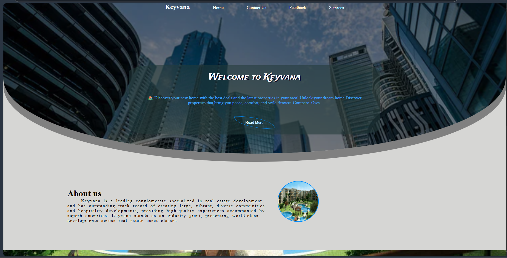

# Day 7 Task - Mini Website
    **this is a task6 for ITI Summer Training 2025 Web Development Using React.**

-----------------------------------

## technologies used
    -html
    -css

----------------------------------

## features
    *✅ "About Us" section to display company information
    *🖼 Attractive image displayed next to the text
    *💡 Simple and user-friendly layout

----------------------------------

## screenshot
    
    )

---------------------------------

## project folder:
    -index.html
    -readme.md
    -css (folder)
        *style.css
    -js (folder)
        *script
    -img (folder)
        *bg.png
        *ph.png
        *sec.png
        *web1.png
        *web2.png

-------------------------------
